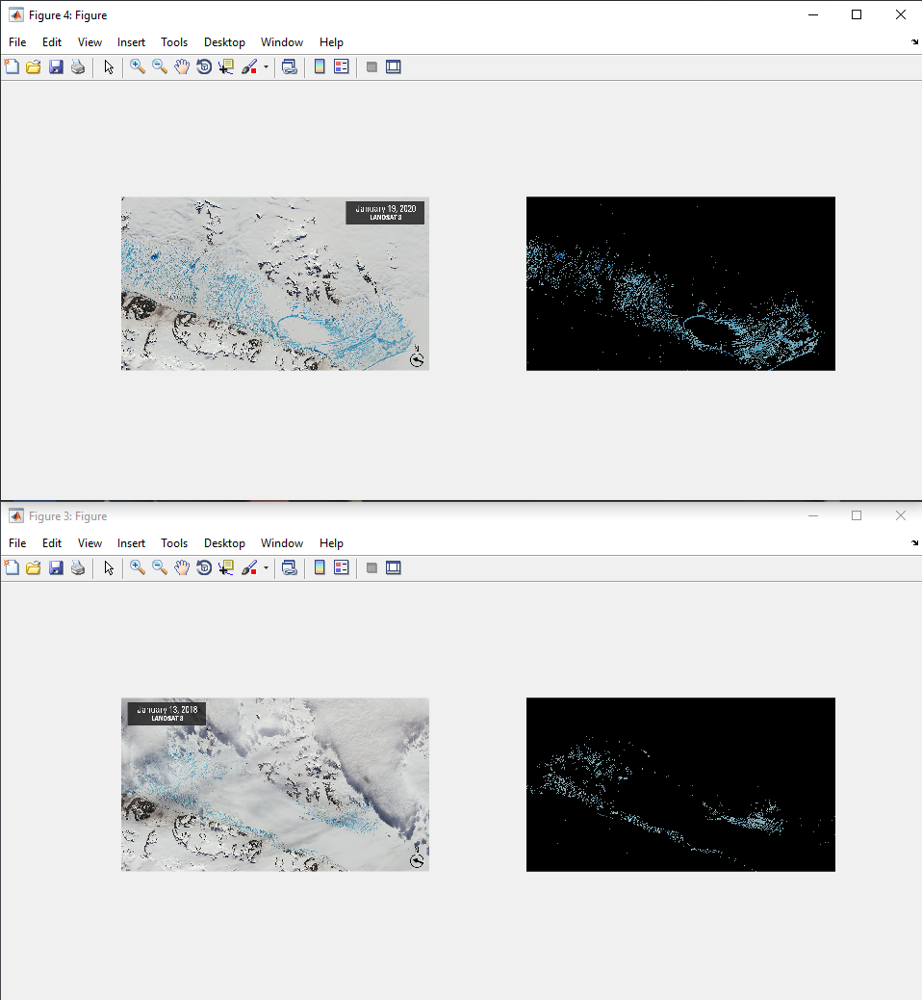

# Ice Melting Image Analysis in MATLAB
 function that segments the water

This repository contains MATLAB code for analyzing ice melting from images. The code processes images of ice melting and provides insights into the melting process.
## Table of Contents

- [Introduction](#introduction)
- [Features](#features)
- [Getting Started](#getting-started)
  - [Prerequisites](#prerequisites)
  - [Installation](#installation)
- [Usage](#usage)

## Introduction

Ice melting analysis is an important field of study with various applications. This MATLAB project aims to provide tools for analyzing images of ice melting and extracting meaningful data from them.

## Features

- Load and preprocess images of melting ice.
- Detect and track ice boundaries.
- Calculate melt rates and visualize the data.
- Perform statistical analysis on the melting process.

## Getting Started

### Prerequisites

To use and contribute to this project, you'll need:

- MATLAB (R2017a or higher)
- Color Thresholder App

### Installation

1. Clone this repository to your local machine using: git clone https://github.com/your-username/ice-melting-analysis.git
2. Open MATLAB and navigate to the repository folder: cd ice-melting-analysis
3. Open the `Ice melting Image Analysis.mlx` script.

##Usage

Prepare your ice melting images and place them in the images directory.
Modify the Ice melting Image Analysis.mlx script to set the appropriate parameters for your images and analysis goals.
Run the Ice melting Image Analysis.mlx script in MATLAB to start the analysis.
The script will process the images, detect ice boundaries, and calculate melt rates.
